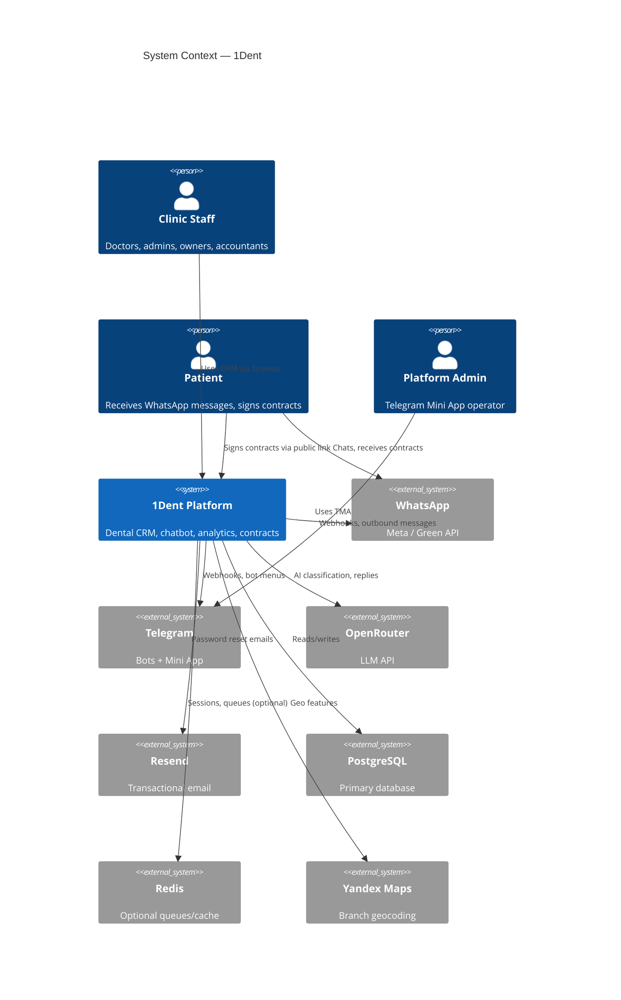
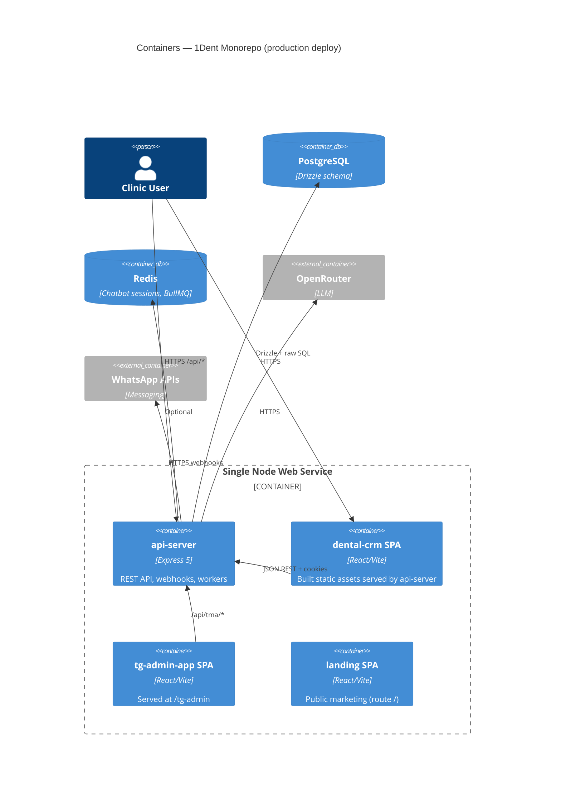
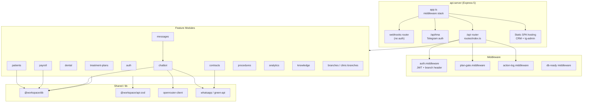
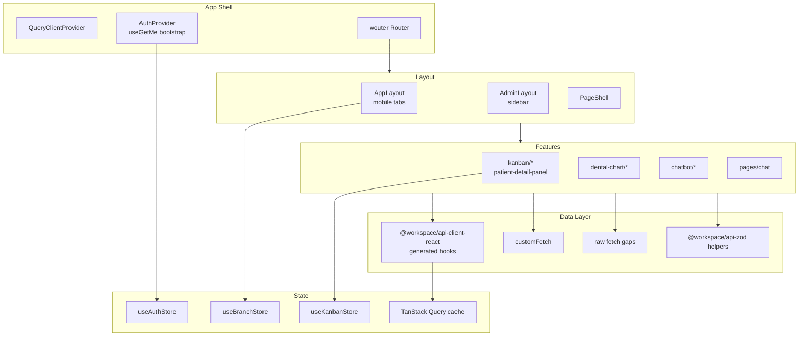
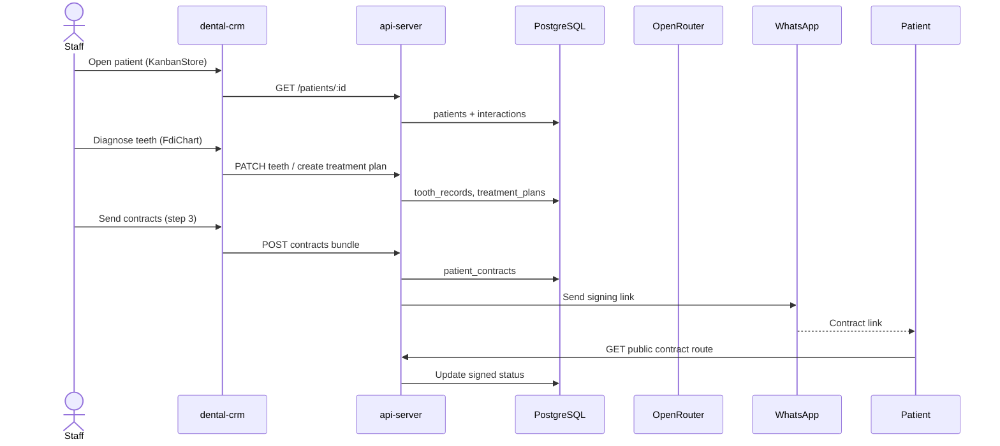
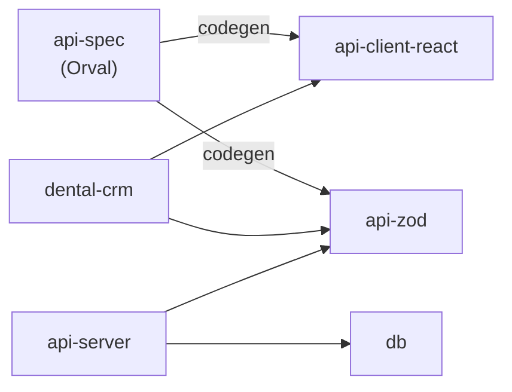
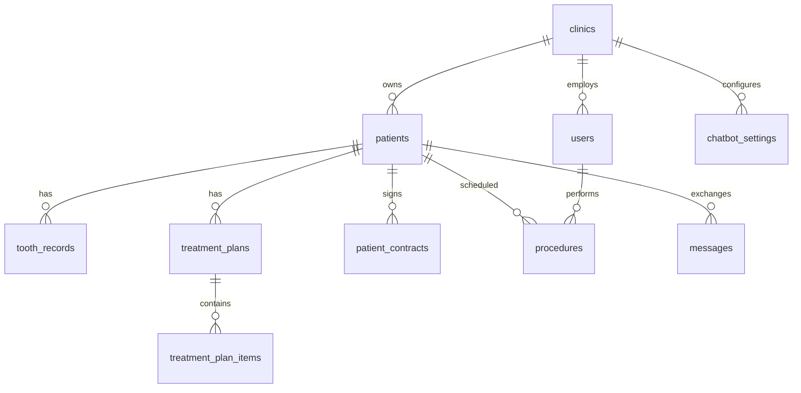

# 1Dent — Project Architecture Blueprint

> **Generated:** 2026-06-29  
> **Branch analyzed:** `dev` (staging) → `master` (production)  
> **Scope:** monorepo `1Dent` — dental CRM for clinics in Kazakhstan/CIS  
> **Method:** codebase analysis (not theoretical); skill: `architecture-blueprint-generator`

---

## Table of Contents

1. [Executive Summary](#1-executive-summary)
2. [Architecture Detection](#2-architecture-detection)
3. [C4 Diagrams](#3-c4-diagrams)
4. [Architectural Overview](#4-architectural-overview)
5. [Monorepo Structure](#5-monorepo-structure)
6. [API Server](#6-api-server)
7. [Frontend (dental-crm)](#7-frontend-dental-crm)
8. [Shared Libraries](#8-shared-libraries)
9. [Data Architecture](#9-data-architecture)
10. [Cross-Cutting Concerns](#10-cross-cutting-concerns)
11. [Deployment Architecture](#11-deployment-architecture)
12. [Testing Architecture](#12-testing-architecture)
13. [Implementation Patterns](#13-implementation-patterns)
14. [Architectural Decision Records](#14-architectural-decision-records)
15. [Blueprint for New Development](#15-blueprint-for-new-development)
16. [Architecture Improvement Plan](#16-architecture-improvement-plan)

---

## 1. Executive Summary

1Dent is a **pnpm monorepo** with a **modular monolith** backend and multiple React SPAs served from a single Node process in production.

| Layer | Technology | Pattern |
|-------|------------|---------|
| Frontend CRM | React 19, Vite, wouter, TanStack Query, Zustand, shadcn/ui | Feature-folder SPA |
| API | Express 5, TypeScript | Modular monolith (`src/modules/*`) |
| DB | PostgreSQL + Drizzle ORM | Domain-sliced schema in `@workspace/db` |
| Contracts | OpenAPI → Orval | Dual codegen: `api-client-react` + `api-zod` |
| Deploy | Railway/Render, single web service | API serves built SPAs + static assets |
| Branching | `dev` → `master` | Staging before production (`docs/BRANCHING.md`) |

**Key architectural strengths:**
- Clear workspace separation (`artifacts/*`, `lib/*`)
- OpenAPI-driven client generation reduces FE/BE drift
- Domain modules on the server map roughly to business capabilities
- Multi-tenant via `clinicId` on JWT + optional branch header for owners

**Key architectural risks:**
- `patient-detail-panel.tsx` (~2,985 lines) and `treatment-stages-board.tsx` (~2,523 lines) are god-components
- Backend modules couple through **shared DB tables**, not service boundaries
- Minimal automated test coverage (2 wired tests in api-server `pnpm test`)
- Hybrid API consumption on frontend (generated hooks + `customFetch` + raw `fetch`)
- Three parallel design systems recently unified on `dev` but `index.css` vs `dashboard.css` vs page-level tokens still coexist

---

## 2. Architecture Detection

### 2.1 Technology Stack

| Area | Detected stack |
|------|----------------|
| Monorepo | pnpm workspace (`pnpm-workspace.yaml`: `artifacts/*`, `lib/*`) |
| Language | TypeScript 5.9 |
| Frontend | React 19, Vite 7, Tailwind 4, Framer Motion, Lucide |
| Routing | wouter (not React Router) |
| Server state | TanStack React Query v5 |
| Client UI state | Zustand (3 stores) |
| Backend | Express 5, pino-http logging |
| ORM | Drizzle ORM + `pg` pool |
| Validation | Zod (`api-zod` generated + inline in controllers) |
| AI | OpenRouter (chatbot, dental AI, contract extraction) |
| Messaging | WhatsApp (Meta API + Green API), Telegram bots |
| Queues | BullMQ-style workers (Redis optional): followups, action logs, migration |
| i18n | react-i18next (ru/kz/en) |

### 2.2 Architectural Pattern

**Primary:** Modular Monolith (Layered within modules)

```
HTTP Request
  → Express middleware (auth, plan-gate, action-log)
  → Controller (route handlers)
  → Service (business logic, some modules)
  → Repository (Drizzle queries, some modules)
  → @workspace/db (PostgreSQL)
```

**Frontend:** Feature-Sliced + Page-Route hybrid

```
App.tsx (providers, auth bootstrap)
  → ProtectedRoute (role guard)
  → Layout (AppLayout | AdminLayout)
  → Page (route component)
  → Feature components (kanban/, dental-chart/, chatbot/)
  → ui/ primitives (shadcn)
```

**Not microservices.** Single deployable `api-server` hosts API + CRM SPA + tg-admin SPA.

### 2.3 Hybrid Patterns Observed

| Pattern | Where | Note |
|---------|-------|------|
| Repository pattern | patients, payroll, contracts, dental | Partial — controllers often query `db` directly |
| Generated API client | dental-crm pages | Primary data path |
| God component | `patient-detail-panel.tsx` | Multiple domains in one file |
| Schema coupling | chatbot ↔ patients ↔ contracts | Via `@workspace/db` tables, not module APIs |
| iOS-style shell | `AppLayout`, `PageShell`, `IosGroup` | Coexists with dashboard DS (`dashboard.css`) |

---

## 3. C4 Diagrams

### 3.1 System Context (C4 Level 1)



### 3.2 Container Diagram (C4 Level 2)



### 3.3 Component Diagram — api-server (C4 Level 3)



### 3.4 Component Diagram — dental-crm (C4 Level 3)



### 3.5 Data Flow — Patient Treatment Journey



---

## 4. Architectural Overview

### 4.1 Guiding Principles (as implemented)

| Principle | Evidence |
|-----------|----------|
| **Monorepo cohesion** | Shared `lib/db`, `lib/api-*`; single deploy script |
| **API-first contracts** | Orval codegen from OpenAPI (`lib/api-spec`) |
| **Multi-tenant by clinic** | JWT `clinicId`; branch override via `x-clinic-branch-id` for owners |
| **Role-based UX** | `ProtectedRoute` + role arrays per route in `App.tsx` |
| **Progressive complexity in UI** | Lazy-loaded tabs in patient panel (`ContractsTab`, `DentalAiAnalysisPanel`) |
| **Operational pragmatism** | Raw SQL where Drizzle bootstrap needed; inline Zod in routes |

### 4.2 Architectural Boundaries

| Boundary | Enforced? | Mechanism |
|----------|-----------|-----------|
| FE ↔ BE | Partial | OpenAPI codegen; gaps use raw fetch |
| Module ↔ Module (BE) | Weak | Shared `db` schema; occasional cross-imports |
| Tenant isolation | Strong | `clinicId` on JWT + query filters |
| Branch context | Medium | Header + auth middleware validation |
| Public vs protected routes | Strong | Webhook/public routers before auth stack |
| Plan/subscription gating | Medium | `planGateMiddleware` after auth |

### 4.3 Dependency Rules (actual)

```
dental-crm  →  api-client-react, api-zod
              ✗ db (never)

api-server    →  db, api-zod
              ✗ api-client-react

api-spec      →  (codegen only) → api-client-react, api-zod

landing       →  (standalone, no workspace libs)

tg-admin-app  →  api-client-react (declared; minimal usage)
```

---

## 5. Monorepo Structure

```
/workspace
├── artifacts/
│   ├── api-server/      # Express API + static host + workers
│   ├── dental-crm/      # Main CRM SPA
│   ├── landing/         # Marketing site (also served at /)
│   ├── tg-admin-app/    # Telegram platform admin
│   └── mockup-sandbox/  # Design experiments (not in deploy)
├── lib/
│   ├── api-spec/        # OpenAPI + Orval config
│   ├── api-client-react/# Generated React Query client
│   ├── api-zod/         # Generated Zod schemas + IIN helpers
│   └── db/              # Drizzle schema + migrations
├── scripts/
│   └── deploy-build.sh  # CI/production build
├── docs/
│   ├── BRANCHING.md
│   ├── DESIGN_SYSTEM.md
│   └── Project_Architecture_Blueprint.md  # this file
├── .github/workflows/ci-cd.yml
└── render.yaml
```

### Package dependency graph



---

## 6. API Server

### 6.1 Entry & Lifecycle

| File | Responsibility |
|------|----------------|
| `artifacts/api-server/src/index.ts` | Listen, bootstrap DB migrations, Telegram webhooks, workers |
| `artifacts/api-server/src/app.ts` | Express middleware, router mounting, SPA static files |
| `artifacts/api-server/src/routes/index.ts` | Feature router registration |

**Startup sequence:**
1. Validate/generate `JWT_SECRET`
2. Mount Express app on `0.0.0.0:$PORT`
3. `bootstrapDatabase()` — migrations, seeds, chatbot session repair
4. `onServerReady()` — Telegram menus, optional Redis workers

### 6.2 Module Inventory (27 domains)

| Module | Path | Primary responsibility |
|--------|------|------------------------|
| auth | `modules/auth/` | Register, login, JWT, password reset |
| users | `modules/users/` | Staff CRUD, invites (couples to payroll on invite) |
| patients | `modules/patients/` | Patient CRUD, status, interactions, IIN |
| dental | `modules/dental/` | Tooth chart, treatments, voice matching, dental AI |
| treatment-plans | `modules/treatment-plans/` | Plans, items, locking |
| procedures | `modules/procedures/` | Appointments, templates, KPIs; triggers chatbot reactivation |
| contracts | `modules/contracts/` | Templates, AI extraction, bundles, signing |
| chatbot | `modules/chatbot/` | WhatsApp FSM, booking, playground, knowledge retrieval |
| messages | `modules/messages/` | Chat UI backend, webhooks; delegates inbound to chatbot |
| knowledge | `modules/knowledge/` | Knowledge sources for AI |
| channels | `modules/channels/` | Marketing channels, Green API setup |
| payroll | `modules/payroll/` | Salary settings, previews, approvals |
| expenses | `modules/expenses/` | Clinic expenses |
| inventory | `modules/inventory/` | Stock, materials |
| analytics | `modules/analytics/` | Owner/admin/doctor KPIs |
| branches | `modules/branches/` | Geo events, check-in |
| clinic-branches | `modules/clinic-branches/` | Parent/child clinic hierarchy |
| followups | `modules/followups/` | Post-op reminders (queued) |
| migration | `modules/migration/` | Data import jobs |
| dental-broadcast | `modules/dental-broadcast/` | Outreach campaigns |
| handoffs | `modules/handoffs/` | Doctor handoffs |
| logs | `modules/logs/` | Action audit log (queued) |
| ai-credits | `modules/ai-credits/` | AI usage metering |
| error-events | `modules/error-events/` | Frontend error ingestion |
| tma | `modules/tma/` | Telegram Mini App admin API |
| clinic | `modules/clinic/` | Condition prices |

### 6.3 Route Registration Order (critical)

```
1. webhooksRouter        — /api/webhook/* (no auth)
2. /api/tma              — Telegram init-data auth
3. /api                  — main router:
   - /auth (rate limited)
   - /errors (public ingest)
   - POST /plan-requests (auth, before plan gate)
   - planGateMiddleware
   - actionLogMiddleware
   - feature routers...
4. refRouter, contractPublicRouter — public contract signing
5. Static /tg-admin, CRM SPA fallback
6. errorHandler
```

### 6.4 Inter-Module Coupling (chatbot, patients, contracts, payroll)

**Direct imports between these four modules: none.**

Coupling is **schema-level** and **orchestration-level**:

| From | To (via) | Mechanism |
|------|----------|-----------|
| chatbot.service | patients, procedures, treatment_plans, teeth | Direct `db` table access |
| messages.service | chatbot.service | Inbound webhook → FSM; outbound pauses bot |
| procedures.controller | chatbot.service | Reactivation after procedure events |
| contracts.repository | patients, users, treatment_plan_items | Bundle building |
| contracts.controller | messages/whatsapp | Send contract links |
| payroll.repository | procedures, geo_events, users | Revenue + hours calculation |
| patients.controller | analytics cache | Invalidation on patient mutations |
| users.controller | payroll.repository | Salary settings on staff invite |

**Implication:** Changing `patients` schema ripples to chatbot, contracts, analytics without compile-time module boundaries.

### 6.5 Database Access Pattern

```typescript
// Typical repository (patients.repository.ts)
db.select().from(patientsTable).where(eq(patientsTable.clinicId, clinicId))

// Auth branch resolution (raw SQL — bypasses Drizzle)
pool.query(`SELECT id FROM clinics WHERE id = $1 AND parent_clinic_id = $2`, [...])

// Inline controller queries (payroll.controller.ts, followups.controller.ts)
db.select()... // directly in controller
```

**Migrations:** `lib/db/drizzle/*.sql` copied to `api-server/dist/drizzle` at build; custom runner in `index.ts` tolerates "already exists" errors.

---

## 7. Frontend (dental-crm)

### 7.1 App Bootstrap

```typescript
// main.tsx — minimal
ThemeProvider → App

// App.tsx — full stack
QueryClientProvider → TooltipProvider → ErrorBoundary → WouterRouter
  → AuthProvider (useGetMe) → Router (routes) → Toasters
```

Module load side effects (`App.tsx`):
- `setBaseUrl(VITE_API_URL)`
- `restoreAuthToken()` → `setAuthTokenGetter`
- `restoreBranchContext()` → `setBranchIdGetter`
- `setUnauthorizedHandler` → clear cache + redirect `/login`

### 7.2 Routing (wouter)

~40 routes in `App.tsx`. Key patterns:
- Role dashboards: `/dashboard`, `/dashboard/admin`, `/dashboard/doctor`, etc.
- Unified patients: `/patients?view=list|kanban` (replaces `/kanban`)
- Tooth detail: `/patients/:patientId/teeth/:fdi`
- Redirects: `/kanban` → `/patients?view=kanban`

Guards (in order):
1. `ProtectedRoute` — auth + role
2. `PlanPaywall` — subscription/trial

### 7.3 State Management Boundaries

| Layer | Tool | Scope | Persisted? |
|-------|------|-------|------------|
| Server/remote data | TanStack Query | API responses, cache | In-memory |
| Auth session | Zustand `useAuthStore` | user, clinic, isAuthenticated | Token in localStorage |
| Kanban UI | Zustand `useKanbanStore` | selectedPatientId, activeTab, create dialog | No |
| Branch filter | Zustand `useBranchStore` | branches list, selectedBranchId | selectedBranchId in localStorage |
| Component-local | useState | forms, modals, wizards | Sometimes localStorage (voice draft) |

**Rule of thumb (as implemented, not documented):**
- **React Query** = server truth
- **Zustand** = cross-page UI session (auth, kanban selection, branch)
- **useState** = ephemeral UI within a screen

**Violations / gray zones:**
- `useBranchStore.fetchBranches()` uses manual fetch, not React Query
- `patient-detail-panel` holds extensive local diagnosis maps alongside React Query data
- Kanban board writes optimistic updates directly to query cache

### 7.4 API Client Consumption

| Style | Usage | Examples |
|-------|-------|---------|
| Generated hooks | Primary | `useListPatients`, `useGetMe`, `useUpdatePatientStatus` |
| `customFetch` | Endpoints without hooks | `use-ai-credits.ts`, onboarding wizard |
| Raw `fetch` | Gaps, uploads | forgot-password, chat file upload, contract bundle actions |

### 7.5 Largest Components (maintainability hotspots)

| File | Lines | Domains bundled |
|------|-------|-----------------|
| `patient-detail-panel.tsx` | 2,985 | Info, diagnosis, plans, contracts, AI, voice, DnD |
| `treatment-stages-board.tsx` | 2,523 | Plan stages, scheduling, modals |
| `plan-item-detail-modal.tsx` | 1,577 | Plan item CRUD, AI, attachments |
| `onboarding-wizard.tsx` | 1,395 | Multi-step owner setup |
| `branches-settings.tsx` | 1,325 | Geo, branches, maps |

### 7.6 Design System (post-migration on `dev`)

Three layers coexist:
1. **Global** — `index.css` + shadcn `ui/*` (recently aligned to `DESIGN_SYSTEM.md`)
2. **Dashboard** — `styles/dashboard.css` + `dash-*` classes
3. **Page-level** — inline `bg-[#faf8f4] font-manrope` on many pages

Landing uses separate `landing.css` with CSS variables — closest to canonical DS.

---

## 8. Shared Libraries

### 8.1 `@workspace/api-spec`

- Orval config generates two outputs from one OpenAPI source
- **Not a runtime package** — build-time only

### 8.2 `@workspace/api-client-react`

Exports:
- Generated React Query hooks (`src/generated/api.ts`)
- TypeScript schemas (`api.schemas.ts`)
- `customFetch` with auth token + branch header injection
- `setBaseUrl`, `setUnauthorizedHandler`

### 8.3 `@workspace/api-zod`

Exports:
- Generated Zod validators per endpoint
- Generated TS types
- Hand-written: `parseIIN`, `maskIIN`, `calculateAge`, `formatDateOfBirth`

**Important:** `api-client-react` does **not** import `api-zod`. Types are duplicated via separate codegen — drift risk if OpenAPI out of sync.

### 8.4 `@workspace/db`

Domain-sliced schema (`lib/db/src/schema/`):

| Schema file | Core tables |
|-------------|-------------|
| clinics | `clinics` (tenant root) |
| users | `users`, `doctor_capacity` |
| patients | `patients`, `patient_interactions` |
| dental | teeth, plans, inventory, AI analyses |
| procedures | procedures, templates, materials, KPIs |
| contracts | templates, patient_contracts |
| chatbot | settings, sessions, funnel events |
| messages | chat_sessions, messages, notifications |
| payroll | salary settings, records, expenses |
| branches | clinic_branches, geo_events |
| knowledge | sources, scripts |
| + migration, channels, handoffs, platform, ai-credits, error-events, logs |

---

## 9. Data Architecture

### 9.1 Tenant Model

```
clinics (tenant)
  ├── users (staff, roles: owner|admin|doctor|accountant|warehouse)
  ├── patients
  ├── clinic_branches (optional hierarchy via parent_clinic_id)
  └── [all domain tables].clinic_id
```

**Branch context (owners only):**
- JWT carries `homeClinicId`
- Header `x-clinic-branch-id` switches active clinic after SQL validation against `parent_clinic_id`

### 9.2 Key Entity Relationships



### 9.3 Validation Flow

```
OpenAPI spec
  ├─→ api-zod (Zod schemas) ──→ api-server controllers (some)
  └─→ api-client-react (TS types) ──→ dental-crm compile-time

Inline Zod in controllers (e.g. plan-requests route) for ad-hoc endpoints
api-zod IIN helpers used on both FE and BE
```

---

## 10. Cross-Cutting Concerns

### 10.1 Authentication & Authorization

| Concern | Implementation |
|---------|----------------|
| Token | JWT in httpOnly cookie + Bearer + query fallback |
| Middleware | `auth.middleware.ts` |
| Roles | `roleGuard(...)` per route |
| TMA | Separate `tma.middleware.ts` — Telegram HMAC, not JWT |
| FE guard | `ProtectedRoute` + route-level `roles` arrays |
| Dev bypass | `VITE_DEV_BYPASS_AUTH` seeds mock owner |

### 10.2 Multi-Tenant & Geo

| Concern | Implementation |
|---------|----------------|
| Tenant | `req.user.clinicId` from JWT |
| Branch switch | `x-clinic-branch-id` + owner-only |
| Geo restriction | `useGeoRestriction` hook + `AppLayout` route blocking |
| Attendance | `AttendanceCheckModal` + `geo_events` table |

### 10.3 Error Handling

| Layer | Pattern |
|-------|---------|
| API | `shared/errors.ts` — `NotFoundError`, `ValidationError`, etc. → `errorHandler` |
| FE | `ErrorBoundary`, toast notifications, `error-events` POST |
| Chatbot | Fallback messages when OpenRouter returns empty |

### 10.4 Logging & Monitoring

- Server: `pino-http` request logging
- Audit: `actionLogMiddleware` + queued writes to `action_logs`
- Client errors: `error-events` module
- No APM/tracing framework detected

### 10.5 Configuration

| Source | Examples |
|--------|----------|
| Env vars | `DATABASE_URL`, `JWT_SECRET`, `OPENROUTER_API_KEY`, `REDIS_URL` |
| Build-time | `VITE_API_URL`, `VITE_DEV_BYPASS_AUTH` |
| DB-stored | `chatbot_settings`, `clinic_channels`, knowledge sources |
| Feature flags | Plan gate middleware, AI credits check |

---

## 11. Deployment Architecture

### 11.1 Build Pipeline

```bash
# scripts/deploy-build.sh
pnpm install --frozen-lockfile
pnpm --filter api-server --filter dental-crm --filter tg-admin-app run build
cp -R lib/db/drizzle/. artifacts/api-server/dist/drizzle/
```

### 11.2 Runtime Topology

**Single web service** (Railway/Render):
- `pnpm --filter @workspace/api-server run start`
- Serves:
  - `/api/*` — REST + webhooks
  - `/tg-admin/*` — Telegram admin SPA
  - `/*` — dental-crm SPA (fallback)
- Health: `GET /api/healthz`

### 11.3 CI/CD (`.github/workflows/ci-cd.yml`)

| Event | Branch | Action |
|-------|--------|--------|
| push/PR | `dev` | Checks (build) only |
| push | `master` | Checks + Railway deploy hook |

### 11.4 Environment Topology

| Environment | Branch | Deploy |
|-------------|--------|--------|
| Staging | `dev` | Manual / optional separate Railway service |
| Production | `master` | Auto-deploy (`render.yaml`: `branch: master`) |

**Recommendation:** Add Railway staging service tracking `dev` branch (not yet configured).

---

## 12. Testing Architecture

### 12.1 Current State

| Package | Test runner | Wired tests | Coverage |
|---------|-------------|-------------|----------|
| api-server | `node --test` + tsx | 2 files in `pnpm test` | De facto ~0% |
| dental-crm | None configured | 0 | 0% |

**Files that exist but are NOT in `pnpm test`:**
- `playground-scenarios.test.mjs`
- `booking-script.test.mjs`
- `knowledge-retrieval.test.mjs`

### 12.2 What's tested

- `openrouter-client.test.ts` — reasoning model helpers
- `chatbot-reply.test.ts` — reply JSON parsing/merge

### 12.3 What's NOT tested

- Express routes / middleware (auth, plan-gate)
- Drizzle repositories
- patients, contracts, payroll modules
- Frontend components and hooks
- E2E flows (patient → plan → contract)

---

## 13. Implementation Patterns

### 13.1 Backend Controller Pattern

```typescript
// Typical: router in controller file
router.get("/", authMiddleware, roleGuard("owner", "admin"), async (req, res, next) => {
  try {
    const data = await repository.findAll(req.user!.clinicId);
    res.json({ success: true, data });
  } catch (err) { next(err); }
});
```

### 13.2 Frontend Data Fetching Pattern

```typescript
// Preferred
const { data } = useListPatients({ query: { queryKey: getListPatientsQueryKey() } });

// Mutation + invalidation
const mutation = useUpdatePatientStatus({
  mutation: {
    onSuccess: () => queryClient.invalidateQueries({ queryKey: getListPatientsQueryKey() }),
  },
});
```

### 13.3 Patient Panel Lazy Loading Pattern

```typescript
// patient-detail-panel-gate.tsx — mount heavy panel only when needed
const selectedPatientId = useKanbanStore((s) => s.selectedPatientId);
if (!selectedPatientId) return null;
return <PatientDetailPanel />;
```

### 13.4 Modal Pattern (post DS migration)

```tsx
<div className="fixed inset-0 bg-black/30 backdrop-blur-sm z-50">
  <div className="bg-white rounded-2xl border border-[#e8e3d9] shadow-xl max-w-lg p-6">
```

---

## 14. Architectural Decision Records

### ADR-001: Monorepo with Single Deployable API Server

| | |
|---|---|
| **Context** | CRM, API, and admin need coordinated releases for a small team |
| **Decision** | One `api-server` serves API + static SPAs |
| **Consequences** | ✅ Simple deploy, shared cookies/auth. ❌ Cannot scale FE/BE independently |
| **Status** | Active |

### ADR-002: OpenAPI Dual Codegen (client + zod)

| | |
|---|---|
| **Context** | Need typed FE client and BE validation from one contract |
| **Decision** | Orval generates `api-client-react` and `api-zod` separately |
| **Consequences** | ✅ Single OpenAPI source. ❌ Duplicate TS types; no runtime link between packages |
| **Status** | Active — watch for drift |

### ADR-003: Schema-Level Module Coupling

| | |
|---|---|
| **Context** | Fast feature delivery for interconnected domains (patient → plan → contract → chatbot) |
| **Decision** | Modules share `@workspace/db` tables directly; minimal inter-module service APIs |
| **Consequences** | ✅ Fast queries, fewer layers. ❌ Schema changes are high-blast-radius |
| **Status** | Active — primary tech debt area |

### ADR-004: Zustand for Session UI State Only

| | |
|---|---|
| **Context** | Need auth + kanban selection across routes without prop drilling |
| **Decision** | 3 small Zustand stores; React Query for server state |
| **Consequences** | ✅ Simple. ❌ `patient-detail-panel` ignores this boundary with massive local state |
| **Status** | Partially followed |

### ADR-005: dev → master Branching (2026)

| | |
|---|---|
| **Context** | Design system migration and feature work needed staging before production |
| **Decision** | `dev` integration branch; CI on both; deploy only `master` |
| **Consequences** | ✅ Safer releases. ❌ Requires discipline on PR targets |
| **Status** | Active (`docs/BRANCHING.md`) |

---

## 15. Blueprint for New Development

### 15.1 Where to Put New Code

| Feature type | Backend | Frontend |
|--------------|---------|----------|
| New REST endpoint | `modules/<domain>/` controller + repository | Page in `pages/` + hooks from generated client |
| New entity | `lib/db/src/schema/<domain>.ts` + migration | Types auto via codegen after OpenAPI update |
| New modal | N/A | `components/<domain>/` or shared `ui/dialog` |
| New dashboard widget | `modules/analytics/` or existing | `components/dashboard/` + `dash-*` CSS |
| Public patient flow | `routes/contract-public.ts` pattern | N/A (server-rendered or public SPA route) |

### 15.2 Development Workflow

1. Branch from `dev`: `cursor/<feature>-8b98`
2. If API changes: update OpenAPI → run Orval codegen → implement controller
3. If DB changes: Drizzle schema + SQL migration in `lib/db/drizzle/`
4. Frontend: prefer generated hooks; extend OpenAPI if endpoint missing
5. PR → `dev` → verify CI → later PR `dev` → `master`

### 15.3 Common Pitfalls

| Pitfall | Avoid |
|---------|-------|
| Raw `fetch` in new FE code | Add endpoint to OpenAPI first |
| Direct `db` queries in new controllers | Use repository for testability |
| Adding logic to `patient-detail-panel.tsx` | Extract sub-feature component |
| Cross-module import on backend | Go through shared table or extract shared service |
| Styling with `gray-*` | Use `DESIGN_SYSTEM.md` tokens |
| PR to `master` directly | Target `dev` |

---

## 16. Architecture Improvement Plan

### 🔴 Critical

#### C1. Decompose `patient-detail-panel.tsx` (2,985 lines)

| | |
|---|---|
| **Problem** | Single component owns diagnosis, plans, contracts, AI, voice, DnD — untestable, high merge conflict risk |
| **Files** | `components/kanban/patient-detail-panel.tsx` |
| **Improvement** | Extract by tab/step: `PatientInfoTab`, `PatientDiagnosisTab`, `PatientPlansTab`, `PatientContractsTab`; shared hook `usePatientPanelData(patientId)` for React Query |
| **Complexity** | **L** |

#### C2. Expand test coverage for critical paths

| | |
|---|---|
| **Problem** | Only 2 wired tests; chatbot/payroll/contracts untested; 3 test files not in `pnpm test` |
| **Files** | `artifacts/api-server/package.json`, `src/modules/chatbot/*`, `src/middlewares/auth.middleware.ts` |
| **Improvement** | Wire all `.test.mjs` files; add auth middleware + patients service unit tests; smoke test `GET /api/healthz` |
| **Complexity** | **M** |

#### C3. Enforce module boundaries on backend

| | |
|---|---|
| **Problem** | chatbot/contracts/payroll couple via shared tables; changes cause silent breakage |
| **Files** | `chatbot.service.ts`, `contracts.repository.ts`, `payroll.repository.ts` |
| **Improvement** | Introduce thin domain services (`PatientLookupService`, `PlanQueryService`) used by cross-domain modules instead of direct table access |
| **Complexity** | **L** |

#### C4. Close OpenAPI / raw fetch gaps on frontend

| | |
|---|---|
| **Problem** | forgot-password, geo, contract bundles, chat uploads bypass generated client — no types, inconsistent auth |
| **Files** | `pages/forgot-password.tsx`, `pages/reset-password.tsx`, `hooks/use-geo-restriction.ts`, `patient-detail-panel.tsx`, `pages/chat.tsx` |
| **Improvement** | Add missing endpoints to OpenAPI; regenerate client; remove raw `fetch` |
| **Complexity** | **M** |

---

### 🟡 Important

#### I1. Split `treatment-stages-board.tsx` (2,523 lines)

| | |
|---|---|
| **Problem** | Plan staging UI + DnD + scheduling in one file |
| **Files** | `components/dental-chart/treatment-stages-board.tsx` |
| **Improvement** | Extract stage column, item card, stage config into separate files; keep DnD context at board level |
| **Complexity** | **M** |

#### I2. Unify design system entry points

| | |
|---|---|
| **Problem** | `index.css`, `dashboard.css`, `landing.css`, page-level hex classes coexist |
| **Files** | `index.css`, `styles/dashboard.css`, `styles/design-system.css` |
| **Improvement** | Single `:root` token source; `dashboard.css` and pages consume CSS variables only |
| **Complexity** | **M** |

#### I3. Standardize backend repository pattern

| | |
|---|---|
| **Problem** | Controllers query `db` directly in payroll, followups, patients, plan-requests |
| **Files** | `payroll.controller.ts`, `followups.controller.ts`, `routes/index.ts` |
| **Improvement** | Move queries to repositories; controllers only orchestrate |
| **Complexity** | **M** |

#### I4. Consolidate modal implementations

| | |
|---|---|
| **Problem** | ~25 custom `fixed inset-0` modals plus shadcn Dialog — duplicated overlay logic |
| **Files** | `components/appointment-modal.tsx`, `kanban/create-patient-dialog.tsx`, etc. |
| **Improvement** | Shared `<Modal>` wrapper using DS §8.7 on top of `ui/dialog.tsx` |
| **Complexity** | **S** |

#### I5. Wire `tg-admin-app` or remove dead package

| | |
|---|---|
| **Problem** | Declares `api-client-react` but minimal source usage; still built on every deploy |
| **Files** | `artifacts/tg-admin-app/` |
| **Improvement** | Either implement TMA UI properly or exclude from `deploy-build.sh` until ready |
| **Complexity** | **S** |

#### I6. Add staging deploy for `dev` branch

| | |
|---|---|
| **Problem** | `dev` has no automated deploy; staging verification is manual |
| **Files** | `render.yaml`, Railway config, `docs/BRANCHING.md` |
| **Improvement** | Second Railway service on `dev` branch with separate DB |
| **Complexity** | **M** |

#### I7. Run all existing chatbot tests in CI

| | |
|---|---|
| **Problem** | `booking-script.test.mjs`, `knowledge-retrieval.test.mjs`, `playground-scenarios.test.mjs` exist but skipped |
| **Files** | `artifacts/api-server/package.json` |
| **Improvement** | `"test": "node --import tsx --test src/**/*.test.ts src/**/*.test.mjs"` |
| **Complexity** | **S** |

---

### 🟢 Nice to Have

#### N1. Extract shared `usePatientDiagnosis` hook

| | |
|---|---|
| **Problem** | Diagnosis state duplicated between panel and tooth routes |
| **Files** | `patient-detail-panel.tsx`, `tooth-detail.tsx` |
| **Improvement** | Shared hook with diagnosis maps + persistence |
| **Complexity** | **M** |

#### N2. React Query for branch list

| | |
|---|---|
| **Problem** | `useBranchStore.fetchBranches()` bypasses React Query |
| **Files** | `hooks/use-branch-store.ts` |
| **Improvement** | `useClinicBranches()` generated hook + Zustand only for `selectedBranchId` |
| **Complexity** | **S** |

#### N3. ADR template in repo

| | |
|---|---|
| **Problem** | Decisions undocumented going forward |
| **Files** | `docs/adr/` (new) |
| **Improvement** | `docs/adr/000-template.md` + index |
| **Complexity** | **S** |

#### N4. Merge api-client types with api-zod at FE boundary

| | |
|---|---|
| **Problem** | Duplicate generated types |
| **Files** | `lib/api-client-react`, `lib/api-zod` |
| **Improvement** | FE imports Zod-inferred types from api-zod for forms; client hooks stay in api-client-react |
| **Complexity** | **M** |

#### N5. Remove dead code in patient panel

| | |
|---|---|
| **Problem** | `ToothActionModal` defined but never rendered; `modalToothFdi` state unused |
| **Files** | `patient-detail-panel.tsx` |
| **Improvement** | Delete or wire up |
| **Complexity** | **S** |

---

## Top 5 Improvements (max impact / min risk)

| Rank | ID | Action | Effort | Impact |
|------|-----|--------|--------|--------|
| 1 | **I7** | Wire all existing tests into `pnpm test` | S | Immediate safety net |
| 2 | **I4** | Shared `Modal` component on `ui/dialog` | S | DS consistency + less duplication |
| 3 | **C4** | OpenAPI gaps → generated client | M | Type safety, fewer auth bugs |
| 4 | **I2** | Unify CSS token source | M | Design consistency after migration |
| 5 | **C1** | Extract first tab from patient panel | L (phased) | Maintainability — start with Info tab only |

---

## Document Maintenance

| Trigger | Action |
|---------|--------|
| New major module added | Update §6.2 module inventory |
| OpenAPI restructure | Update §8 dependency graph |
| Deploy topology change | Update §11 |
| patient-detail-panel split | Update §7.5 and remove C1 |
| Staging env added | Update §11.4 |

**Next review:** after first `dev` → `master` release post design-system migration.

---

*This blueprint reflects the codebase on branch `dev` as of 2026-06-29. FDI clinical tooth colors and business logic are documented as-is, not prescriptive.*
